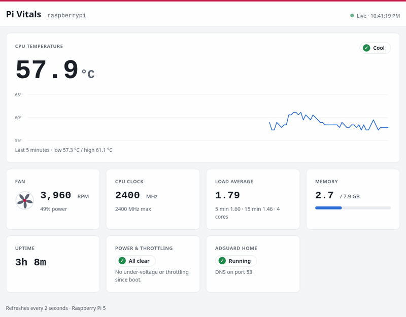

<p align="center">
  <h3 align="center">Pi Vitals</h3>

  <p align="center">A live dashboard that displays data about my Raspberry Pi 5</p>

  <p align="center">Not deployed to the public - for my home network</p>
</p>

<p align="center">
  
</p>

## About The Project

### Why this exists:
I ordered & received a Raspberry Pi 5 (8GB) running Raspberry Pi OS. I had Claude assist me with updates & setting up my dev environment. 
Afterwards I gave Claude a gift, and granted full access to the pi. Claude setup AdGuard Home & built Pi-vitals.
I used the /loop command overnight and woke up to several new projects/changes. I asked for feedback on how we can improve our next /loop session. I’m excited to see how /loop & gathering a team of agents can change our workflow.

Pi Vitals is the first project built on the Pi itself. It's a small Express app that reads the Pi's own hardware sensors and shows them on a live dashboard I can open from any device on my home network.

## How It Works

### Features
* CPU temperature with a Cool / Warm / Hot status and a 5-minute history graph (hover for exact readings)
* Fan speed in RPM and % power, with an animated fan icon that spins faster as the real fan speeds up
* CPU clock speed, load average, memory use, and uptime
* Power & throttling check: warns about under-voltage or thermal throttling, right now or since boot
* AdGuard Home status: shows whether the DNS service is running
* Wi-Fi card: signal strength (dBm and link quality) plus live download and upload speeds
* What's using the CPU: the top 5 programs by current CPU use, with memory, grouped by name (like a mini `top`)
* Refreshes every 2 seconds, with light and dark mode and a layout that works on phones
* Respects reduced-motion settings (the fan and live indicator stop animating)

### Technologies


### Full Breakdown

**Where the data comes from**

Everything is read straight from the Pi. No database, no outside services, and nothing needs sudo.

| Stat | Source |
|---|---|
| CPU temperature | `/sys/class/thermal/thermal_zone0/temp` |
| Fan RPM and power | `/sys/devices/platform/cooling_fan/hwmon/*/fan1_input` and `pwm1` |
| CPU clock | `/sys/devices/system/cpu/cpu0/cpufreq/scaling_cur_freq` |
| Memory | `/proc/meminfo` |
| Load and uptime | Node's built-in `os` module |
| Power & throttling | `vcgencmd get_throttled` |
| AdGuard Home | `systemctl is-active AdGuardHome` |
| Wi-Fi signal and speeds | `/proc/net/wireless` and `/proc/net/dev` |
| Top programs | `/proc/<pid>/stat`, compared between polls (page size and clock ticks from `getconf`) |

**How the pieces fit**

```
server.js                       Express setup: helmet, morgan, static files, 404 and error handlers
routes/vitalsRoutes.js          GET /  (the dashboard)  and  GET /api/vitals  (JSON)
controller/vitalsController.js  Reads every sensor in parallel and returns one JSON object
views/dashboard.ejs             Dashboard markup
views/error.ejs                 404 / error page
public/js/main.js               Polls /api/vitals every 2s and updates the page and graph
public/css/styles.css           All styles, light and dark mode
```

The browser asks `/api/vitals` for fresh numbers every 2 seconds. The server reads the sensors and sends back JSON. The page then updates the numbers, redraws the temperature graph (an SVG built with plain JavaScript), and adjusts the fan animation speed.

**Why it isn't hosted online**

The app reads the hardware of the machine it runs on, so it has to run on the Pi. 

**Running it**

```bash
npm install
npm start
```

Then open http://127.0.0.1:3141 on the Pi.

To open it from other devices on the home network, create a `.env` file:

```
HOST=0.0.0.0
PORT=3141
```

and visit `http://<pi-ip-address>:3141`.

**Starting it at boot**

`deploy/pi-vitals.service` is a systemd *user* service: it runs as you, not root, and restarts itself if it crashes. It loads Node through nvm, so it keeps working if your default Node version changes.

```bash
mkdir -p ~/.config/systemd/user
cp deploy/pi-vitals.service ~/.config/systemd/user/
systemctl --user daemon-reload
systemctl --user enable --now pi-vitals
loginctl enable-linger "$USER"   # start at boot even before anyone logs in
```

Handy commands: `systemctl --user status pi-vitals`, `systemctl --user restart pi-vitals` (after changing `.env` or pulling updates), and `journalctl --user -u pi-vitals -f` for logs. While the service is running, it holds port 3141, so stop it before running `npm start` by hand.

